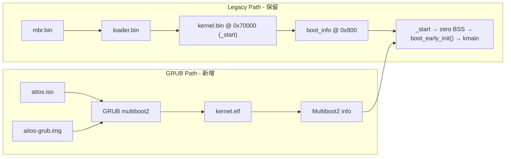

# AiTOS GRUB 引导与 QEMU 调试 — 设计方案

> 修订日期：2026-06-28（v3 实现中）  
> 状态：Phase 1 基础设施已落地；GRUB → Shell 端到端待完善  
> 关联：[x86-64 迁移设计](x86_64-migration.md)

## 1. 背景与目标

当前 AiTOS 通过自研 **MBR → loader → flat `kernel.bin` @ `0x70000`** 启动（见 [`Makefile`](../../Makefile) 的 `dd` 规则与 [`arch/x86_64/boot/`](../../arch/x86_64/boot/)）。x86-64 迁移设计文档原将 GRUB 列为后续项；本方案在其基础上**新增 GRUB 路径**，legacy 路径保留用于对照学习。

**本次目标：**

- **双路径并存**：保留 `make image` / `make run-qemu`（legacy）；新增 GRUB 路径
- **双介质**：`bin/aitos.iso`（日常调试，**优先实现**）+ `bin/aitos-grub.img`（MBR 分区盘验证，Phase 2）
- **QEMU 调试**：Legacy 与 GRUB 均可用 `-S -gdb tcp:127.0.0.1:1234`，GDB 统一 pending `break kmain`

**与 x86-64 迁移设计的偏差（有意技术债）：**

| 迁移设计 | 本方案 | 原因 |
|----------|--------|------|
| 内核链接 high-half `0xFFFFFFFF80000000` | 暂保持 identity `0x70000` | 与 legacy flat boot 共用一份 `kernel.elf`，避免双构建 |
| GRUB 在「本次不做」 | 新增 GRUB 路径 | 演进需求；legacy 仍保留 |

**前置阻塞（与 GRUB 无关但需先修）：** Makefile 依赖 [`sched/core.c`](../../sched/core.c) 但该文件缺失，任何启动路径都需先补 MVP stub，否则 `make image` 失败。

---

## 2. 总体架构



**核心原则：**

1. 同一份 `kernel.elf` 服务两条路径：legacy 用 `objcopy → kernel.bin`，GRUB 直接加载 ELF。
2. **`_start` 必须位于镜像基址 `0x70000`**（legacy loader 跳物理基址，非 ELF entry 偏移）。
3. Multiboot2 header 放在 `_start` 之后、仍在 OS 镜像前 32 KiB 内（GRUB 扫描 magic，不要求 offset 0）。
4. **引导来源信息必须在 BSS 清零前保存**（栈或 `.data`），见 §3.2。

---

## 3. 阶段 1：Multiboot2 内核入口

### 3.1 Multiboot2 Header 布局（关键约束）

**错误做法（会破坏 legacy）：** 将 `.multiboot` 排在 `.head.text` 之前 → `kernel.bin` 在 `0x70000` 处为 header 数据，loader `jmp 0x70000` 无法进入 `_start`。

**正确做法：** `_start` 在链接基址，`header` 紧随其后：

```ld
.text : AT(KERNEL_PHYS) {
    *(.head.text)       /* _start @ 0x70000 — legacy 跳转目标 */
    *(.multiboot)       /* header 紧随其后，仍在 32 KiB 扫描范围内 */
    *(.text .text.*)
    *(.init.text)
} :text
```

新增 [`arch/x86_64/multiboot2.asm`](../../arch/x86_64/multiboot2.asm)（推荐独立文件，便于维护）：

- Header 字段：`magic = 0xE85250D6`、`architecture = 0`（Multiboot2 规范要求 i386 兼容头）、`header_length`、校验和
- Header tag：`type 1` information request → 请求 `MBOOT2_TAG_TYPE_MMAP`
- Header tag：`type 0` end
- **不要**在 header 中硬编码 `address` tag（GRUB 按 ELF PT_LOAD 加载即可）

Makefile `OBJS` 增加 `build/arch/x86_64/multiboot2.o`（若独立文件）。

链接地址保持 [`linker.ld`](../../arch/x86_64/linker.ld) 中 `KERNEL_VMA = KERNEL_PHYS = 0x70000`，与 [`boot.inc`](../../arch/x86_64/boot/boot.inc) 一致。

### 3.2 双路径 `_start`（含 BSS 顺序约束）

**错误做法：** 在清零 BSS **之前** 写入 `boot_source` / `multiboot_mbi_phys`（若放在 `.bss`）→ 随后 `rep stosb` 会把写入清掉，GRUB 路径内存探测失败。

**正确顺序：** 保存引导信息 → 设栈 → 清零 BSS → `boot_early_init` → `kmain`。

改造 [`arch/x86_64/kernel.asm`](../../arch/x86_64/kernel.asm)（**方案 A：栈传递，推荐**）：

```nasm
_start:
    cli
    ; --- 保存引导 handoff 信息（BSS 清零前）---
    cmp eax, 0x36d76289          ; MULTIBOOT2_BOOTLOADER_MAGIC
    jne .legacy_push
    push rbx                     ; GRUB: RBX = MBI 物理地址
    push qword BOOT_SOURCE_MULTIBOOT2
    jmp .common
.legacy_push:
    ; Legacy: loader 跳转前 mov rax, 0x70000 → RAX != magic
    push qword 0                 ; 无 MBI
    push qword BOOT_SOURCE_LEGACY
.common:
    mov rsp, EARLY_STACK_TOP
    and rsp, ~0xf
    ; 清零 BSS
    mov rdi, __bss_start
    mov rcx, __bss_end
    sub rcx, rdi
    xor eax, eax
    cld
    rep stosb
    ; 恢复栈上的引导信息，传给 boot_early_init
    pop rdi                      ; boot_source
    pop rsi                      ; mbi_phys（legacy 为 0）
    call boot_early_init
    call kmain
```

**备选（方案 B）：** 将 `boot_source`、`multiboot_mbi_phys` 定义为 `.data` 变量（非 BSS），检测后直接写入，再清 BSS。维护成本略高，但 C 侧可直接读全局变量。

**GRUB handoff 假设：** long mode、paging 已启用；`_start` 重设栈并 `cli` 即可。后续若迁 high-half，需在此验证页表映射。

**可选增强（P2）：** 在 legacy `boot_info` 增加 `boot_source` magic，替代单纯依赖 EAX 检测。

### 3.3 统一 boot_info 抽象

新增 [`boot/early.c`](../../boot/early.c) + [`include/aitos/boot.h`](../../include/aitos/boot.h)：

| 函数 | 职责 |
|------|------|
| `boot_early_init(u64 source, u64 mbi_phys)` | 按引导来源填充全局 `struct boot_info` |
| `boot_info_get()` | 供 [`mm/bootstrap.c`](../../mm/bootstrap.c) 读取 |

**Legacy 路径：** `boot_info_load()` 从 `AITOS_BOOT_INFO_PHYS (0x800)` 物理读（loader E820 已写入）。

**GRUB 路径：** [`boot/multiboot2.c`](../../boot/multiboot2.c) 解析 MBI：

- 校验 magic `0x36d76289`、总长度、8 字节对齐
- 遍历 tag，提取 `MBOOT2_TAG_TYPE_MMAP`，累加 type=1（可用 RAM）区域
- 填充 `boot_info { magic, mem_bytes, kernel_phys = 0x70000 }`

[`mm/bootstrap.c`](../../mm/bootstrap.c) 改为调用 `boot_info_get()`，不再直接硬编码物理地址读取。

**延后（不在 Phase 1）：** MBI cmdline tag 解析、`framebuffer` tag。

---

## 4. 阶段 2：GRUB 配置与镜像构建

### 4.1 目录结构

```
grub/
  grub.cfg              # headless（串口 GRUB 菜单）
scripts/
  build-grub-iso.sh     # grub-mkrescue（Phase 1）
  build-grub-disk.sh    # MBR 分区盘 + grub-install（Phase 2）
  run-qemu-grub.sh      # 统一运行脚本（GRUB_BOOT=iso|disk）
  debug-qemu-grub.sh    # QEMU stub（-S -gdb）
  debug-grub.sh         # 一键调试（stub + 交互 GDB，仿 debug.sh）
```

**脚本合并原则：** 运行/调试脚本通过 `GRUB_BOOT=iso|disk` 切换介质，避免 4 份几乎相同的 shell 脚本。

### 4.2 `grub/grub.cfg`

**Phase 1 仅支持 headless**（`-nographic`）。`grub.cfg` 强制串口终端：

```grub
set timeout=0
set default=0

# 配合 QEMU -nographic：GRUB 菜单输出到 COM1
serial --unit=0 --speed=115200
terminal_input serial
terminal_output serial

menuentry "AiTOS" {
    multiboot2 /boot/kernel.elf
    boot
}
```

**说明：**

- 不使用 `console=serial` 作为 multiboot 参数——内核尚未实现 cmdline 解析，该参数无效。
- **Phase 1 不提供 `run-qemu-grub-gui`**：上述 `terminal_* serial` 与 VGA 窗口冲突；GUI 模式延后（Phase 2 可选 `grub/grub-gui.cfg`，去掉 serial/terminal 配置）。

### 4.3 ISO 镜像（`bin/aitos.iso`）— Phase 1 优先

[`scripts/build-grub-iso.sh`](../../scripts/build-grub-iso.sh)：

1. 依赖 `$(KERNEL_ELF)` 与 `$(HD80_IMG)`（**不**依赖完整 `image`，避免连带构建 `hd60M.img`）
2. `build/grub-iso/boot/kernel.elf` ← 复制 `build/kernel.elf`
3. `build/grub-iso/boot/grub/grub.cfg` ← 复制 `grub/grub.cfg`
4. `grub-mkrescue -o bin/aitos.iso build/grub-iso/`

Makefile：

```makefile
grub-iso: $(KERNEL_ELF) $(HD80_IMG)
	@bash scripts/build-grub-iso.sh
```

**QEMU 启动（ISO，headless）：**

```bash
qemu-system-x86_64 \
  -cdrom bin/aitos.iso \
  -drive file=bin/hd80M.img,format=raw,if=ide,index=1,media=disk \
  -boot order=d,menu=off \
  -m 128 -cpu qemu64 -no-reboot \
  -nographic
```

> IDE index 0 = CD-ROM；`hd80M.img` 挂 index 1。与 legacy（hd60@0 + hd80@1）不同，脚本中显式区分。

### 4.4 分区磁盘（`bin/aitos-grub.img`）— Phase 2

[`scripts/build-grub-disk.sh`](../../scripts/build-grub-disk.sh) 流程：

1. 创建 64 MiB 镜像，**MBR 分区表**（非 GPT；`i386-pc` + QEMU BIOS 最简单）
2. 分区 1（~32 MiB，bootable, type `0x0C` FAT32）：`mkfs.vfat`
3. **loop 挂载**（需 root 或 `CAP_SYS_ADMIN`）写入 `/boot/kernel.elf`、`/boot/grub/grub.cfg`
4. `grub-install --target=i386-pc --boot-directory=<mount>/boot --modules="multiboot2" --force <loop>`
5. 文档与脚本输出注明：**分区盘构建需 root**；CI 仅验证 ISO

| 工具 | 用途 |
|------|------|
| loop mount + `grub-install` | 完整模拟 BIOS 磁盘引导（Phase 2） |
| `mtools` | 可选辅助拷贝文件；**不能**替代 `grub-install` 写 MBR |

**QEMU 启动（磁盘）：**

```bash
qemu-system-x86_64 \
  -drive file=bin/aitos-grub.img,format=raw,if=ide,index=0 \
  -drive file=bin/hd80M.img,format=raw,if=ide,index=1 \
  -boot order=c,menu=off \
  -m 128 ...
```

### 4.5 Makefile 新目标

| 目标 | 依赖 | 行为 | 阶段 |
|------|------|------|------|
| `grub-iso` | `$(KERNEL_ELF)` + `$(HD80_IMG)` | 生成 `bin/aitos.iso` | 1 |
| `run-qemu-grub` | `grub-iso` | 前台 QEMU（ISO，headless） | 1 |
| `debug-qemu-grub` | `DEBUG=1 grub-iso gdbscripts` | 仅启动 QEMU stub | 1 |
| `debug-grub` | `debug-qemu-grub` | 一键：stub + 交互 GDB（仿 `make debug`） | 1 |
| `grub-disk` | `$(KERNEL_ELF)` | 生成 `bin/aitos-grub.img` | 2 |
| `run-qemu-grub-disk` | `grub-disk` | 前台 QEMU（磁盘） | 2 |
| `debug-grub-disk` | `debug-qemu-grub` + disk | 同上（磁盘介质） | 2 |

保留现有 `image` / `run-qemu` / `debug` 不变（legacy 调试链同步升级，见 §5.2）。

环境变量：

| 变量 | 值 | 说明 |
|------|-----|------|
| `GRUB_BOOT` | `iso`（默认）\| `disk` | 选择 GRUB 介质 |
| `QEMU_BOOT` | `cd` \| `c` | 传给 `qemu-ui.sh` 的 boot order |

### 4.6 `qemu-ui.sh` 改造

当前 [`scripts/qemu-ui.sh`](../../scripts/qemu-ui.sh) 在 **`qemu_run_extra_args`** 与 **`qemu_gui_display_args`** 两处均硬编码 `-boot order=c,menu=off`；后者被 [`debug-qemu.sh`](../../scripts/debug-qemu.sh) 使用，ISO 启动会冲突。

**改造：** 抽取公共 boot order，`QEMU_BOOT` 同时作用于两个函数：

```bash
_qemu_boot_args() {
    local boot="${QEMU_BOOT:-c}"
    printf '%s\n' "-boot order=${boot},menu=off"
}

qemu_run_extra_args() {
    _qemu_boot_args
    ...
}

qemu_gui_display_args() {
    _qemu_boot_args
    ...
}
```

Legacy 脚本不传 `QEMU_BOOT`，默认 `c`，行为不变。GRUB ISO 脚本设 `QEMU_BOOT=cd`。

---

## 5. 阶段 3：QEMU 调试适配

### 5.1 调试差异

| 项 | Legacy | GRUB |
|----|--------|------|
| 复位断点 `-S` | 停在 BIOS/loader 之前 | 停在 BIOS；`c` 经过 GRUB 后才到内核 |
| 可靠断点 | pending `break kmain`（统一方案） | 同左 |
| 符号文件 | `build/kernel.elf` | 同左 |
| 启动设备 | `hd60M.img`, `-boot c` | ISO: `-cdrom`, `-boot d`；磁盘: `aitos-grub.img`, `-boot c` |
| 一键调试 | `make debug` → `debug.sh` | `make debug-grub` → `debug-grub.sh` |

### 5.2 统一 GDB 脚本（Legacy + GRUB 共用）

**不再维护**独立的 GRUB GDB 脚本。升级 [`scripts/gdb/aitos.gdb.in`](../../scripts/gdb/aitos.gdb.in)：

```gdb
set architecture i386:x86-64
set disassembly-flavor intel
set breakpoint pending on

break kmain
commands
  silent
  printf "\n[AiTOS] kmain\n\n"
end
```

**同步改造 legacy 调试链**（当前 `make debug` 仍 source 依赖 `loader_debug_gate` 的 [`aitos-debug.gdb.in`](../../scripts/gdb/aitos-debug.gdb.in)，而 x86_64 loader 无此符号，调试已 broken）：

| 文件 | 改动 |
|------|------|
| [`scripts/debug.sh`](../../scripts/debug.sh) | `source build/gdb/aitos.gdb`（替换 `aitos-debug.gdb`） |
| [`scripts/gdb-console.sh`](../../scripts/gdb-console.sh) | 同上 |
| [`.vscode/launch.json`](../../.vscode/launch.json) | `program=kernel.elf`；`source aitos.gdb`；architecture=`i386:x86-64` |
| [`scripts/gdb/aitos-debug.gdb.in`](../../scripts/gdb/aitos-debug.gdb.in) | 标记 deprecated；或改为检测到 `loader_debug_gate` 符号时才启用（P2） |

**调试流程（Legacy 与 GRUB 相同）：**

```bash
# GRUB
make DEBUG=1 grub-iso
make debug-grub          # debug-grub.sh → debug-qemu-grub.sh start + GDB

# Legacy
make DEBUG=1 image
make debug               # debug.sh → debug-qemu.sh start + GDB

# GDB 中: c → （GRUB 需等待 GRUB boot）→ 断在 kmain
```

**Legacy loader gate（可选 P2）：** 在 [`loader.asm`](../../arch/x86_64/boot/loader.asm) 补 `%ifdef DEBUG_BUILD` 的 `loader_debug_gate`；非 Phase 1 必须。

### 5.3 脚本改造

- [`scripts/run-qemu-grub.sh`](../../scripts/run-qemu-grub.sh)：`GRUB_BOOT=iso|disk`；设 `QEMU_BOOT=cd|c`；复用 `qemu-ui.sh`；Phase 1 仅 headless
- [`scripts/debug-qemu-grub.sh`](../../scripts/debug-qemu-grub.sh)：替换 drive 布局 + `-S -gdb tcp:127.0.0.1:${GDB_PORT}`；可参数化 [`debug-qemu.sh`](../../scripts/debug-qemu.sh) 减少重复
- [`scripts/debug-grub.sh`](../../scripts/debug-grub.sh)：仿 [`debug.sh`](../../scripts/debug.sh)，内部调 `debug-qemu-grub.sh start`，GDB session source `build/gdb/aitos.gdb`

### 5.4 VS Code

- 新增 **"Debug AiTOS (GRUB)"**：`preLaunchTask: qemu-debug-grub`；`source build/gdb/aitos.gdb`
- 修正 **"Debug AiTOS (QEMU + GDB)"**（legacy）：同上 GDB 脚本；`program=build/kernel.elf`

---

## 6. 阶段 4：开发环境与文档

### 6.1 依赖安装

扩展 [`scripts/install_devenv.sh`](../../scripts/install_devenv.sh)：

| 包 | 用途 | 阶段 |
|----|------|------|
| `grub-pc-bin` / `grub2` | Multiboot2 模块 | 1 |
| `grub-common` | `grub-mkrescue` | 1 |
| `xorriso` | ISO 生成 | 1 |
| `dosfstools` | `mkfs.vfat` | 2 |
| `mtools` | 可选 FAT 文件拷贝 | 2 |

macOS：Homebrew `grub`, `xorriso`；Phase 2 加 `mtools`。

### 6.2 文档更新

- [`README.md`](../../README.md)：启动章节区分 legacy / GRUB ISO / GRUB 磁盘
- [`x86_64-migration.md`](x86_64-migration.md)：§1 引导行更新为「legacy 已实现；GRUB 见 grub-boot.md」

---

## 7. 验收标准

### Phase 1（ISO + 调试）

1. `make grub-iso`、`make run-qemu-grub` 到达 `[aitos@localhost]$`
2. `mm: bootstrap N MB RAM` 数值合理（MBI mmap；**非 0、非错误 fallback**）
3. `make run-qemu` legacy 回归通过（**关键**：`_start` 仍在 `0x70000`）
4. `readelf -h build/kernel.elf` 确认 entry point = `_start` @ `0x70000`
5. `make debug-grub` → `c` → 断 `kmain` → Shell 可交互
6. **`make debug`（legacy）→ `c` → 断 `kmain`**（验证 GDB 统一）
7. VS Code GRUB / legacy 配置可用

### Phase 2（分区盘）

8. `make grub-disk` 无报错（root 环境）
9. `make run-qemu-grub-disk` 启动成功

---

## 8. 风险与决策记录

| 风险 | 缓解 |
|------|------|
| Multiboot header 破坏 legacy 跳转 | **`_start` 在基址，header 紧随其后**（§3.1） |
| BSS 清零覆盖引导来源 | **栈传递或 `.data` 变量**（§3.2） |
| 链接地址 `0x70000` 非 Multiboot 惯例 | 短期双路径共存；后续 `LINK=highhalf` + 废弃 legacy |
| ISO 与 legacy IDE 布局不同 | `QEMU_BOOT` + 脚本独立 drive 参数 |
| GRUB 调试需经过 BIOS+GRUB | pending `break kmain`；`-S` 后一次 `c` |
| `qemu-ui.sh` boot order 冲突 | `QEMU_BOOT` 覆盖 **两个** boot 函数（§4.6） |
| Legacy `make debug` broken | Phase 1 同步切到 `aitos.gdb`（§5.2） |
| GRUB GUI 未定义 | Phase 1 仅 headless；GUI 延后 |
| 分区盘需 root | Phase 2；CI 只测 ISO |
| `sched/core.c` 缺失 | 实施前先补 stub |

---

## 9. 实施顺序与任务清单

| 序号 | 任务 | 阶段 | 状态 |
|------|------|------|------|
| 1 | 补 `sched/core.c` MVP stub | 0 | 待开始 |
| 2 | Multiboot2 header + `_start`（栈传递）+ `boot/multiboot2.c` | 1 | 待开始 |
| 3 | `grub/grub.cfg`、`build-grub-iso.sh`、Makefile `grub-iso` / `run-qemu-grub` | 1 | 待开始 |
| 4 | `qemu-ui.sh` 参数化 `QEMU_BOOT`（含 `qemu_gui_display_args`） | 1 | 待开始 |
| 5 | `debug-qemu-grub.sh` + `debug-grub.sh`；统一 GDB + legacy `debug.sh` 同步 | 1 | 待开始 |
| 6 | VS Code launch/tasks 修正 | 1 | 待开始 |
| 7 | `build-grub-disk.sh` + `run-qemu-grub-disk` / `debug-grub-disk` | 2 | 待开始 |
| 8 | `install_devenv.sh`、README、`x86_64-migration.md` 同步 | 2 | 待开始 |

预计改动：**新增 ~8 文件，修改 ~10 文件**（Makefile、kernel.asm、linker.ld、mm/bootstrap.c、qemu-ui.sh、debug.sh、gdb-console.sh、launch.json、install_devenv.sh、README）。

---

## 11. 实现进度（2026-06-28）

### 已完成

| 项 | 说明 |
|----|------|
| `sched/core.c` | MVP stub，解除构建阻塞 |
| Multiboot2 | `multiboot2.asm`、`_start` handoff、`boot/early.c`、`boot/multiboot2.c` |
| GRUB ISO | `grub/grub.cfg`、`build-grub-iso.sh`、`make grub-iso` |
| QEMU 脚本 | `run-qemu-grub.sh`、`debug-qemu-grub.sh`、`debug-grub.sh` |
| Makefile | `grub-iso`、`run-qemu-grub`、`debug-grub` 等目标 |
| 调试统一 | `aitos.gdb.in` pending `break kmain`；`debug.sh` 同步 |
| VS Code | GRUB/legacy 配置；`kernel.elf` + `i386:x86-64` |
| Legacy 回归 | `make run-qemu` 正常 |

### 已知问题 / 待办

| 项 | 说明 |
|----|------|
| GRUB → Shell | 引导 handoff 已修复（栈顺序、EAX magic−1、IDT CS=0x10、跳过 GRUB 路径 VGA 重编程）；`make run-qemu-grub` 在部分环境仍无串口输出，可用 `make debug-grub` + GDB 验证 `_start`/`kmain` |
| ISO 启动方式 | `grub-mkrescue` hybrid 镜像须 `-drive file=...,format=raw` 作 `-hda`（非 `-cdrom`）；脚本已采用 |
| 链接地址 | 内核链接 `0x100000`；legacy MBR 暂存 `0x70000` 后拷贝（见 `boot.inc` / `loader.asm`） |
| `grub-disk` | Phase 2 脚本已添加，需 root 验证 |
| MBI 全 tag 遍历 | 完整 walk 在 QEMU 下可能极慢；当前仅解析首个 `MMAP` tag |


---

## 10. Review 修订摘要

### v1 → v2

| 问题 | v1 | v2 修正 |
|------|-----|---------|
| Header 在 `_start` 前 | legacy 启动失败 | `_start` @ 0x70000，header 在后 |
| `console=serial` menuentry | 无效 | 删除；GRUB `serial`/`terminal_*` |
| `qemu-ui.sh` 硬编码 `-boot c` | ISO 无法从 CD 启动 | 参数化 `QEMU_BOOT` |
| 双套 GDB 脚本 | 维护成本高 | 统一 pending `break kmain` |
| 分区盘 GPT/MBR 模糊 | 不确定 | 明确 MBR；标注需 root |

### v2 → v3（第二轮 Review）

| 问题 | v2 | v3 修正 |
|------|-----|---------|
| `_start` 写 BSS 再清零 | 引导信息被覆盖 | 栈传递 / `.data`；§3.2 明确顺序 |
| Legacy `debug.sh` 仍用 broken `aitos-debug.gdb` | GDB 未真正统一 | §5.2 同步改 legacy 调试链 |
| `qemu_gui_display_args` 未改 | GUI debug ISO 仍 `-boot c` | §4.6 两处函数均参数化 |
| GRUB GUI 未定义 | 与 `QEMU_GUI=1` 冲突 | Phase 1 仅 headless |
| `make debug-grub` 入口不清 | 实现歧义 | 新增 `debug-grub.sh`，与 `debug.sh` 对称 |
| `grub-iso` 依赖过宽 | 连带构建 hd60M | 仅依赖 `KERNEL_ELF` + `HD80_IMG` |
| 验收缺 legacy debug / entry 检查 | 覆盖不全 | §7 补充 |
