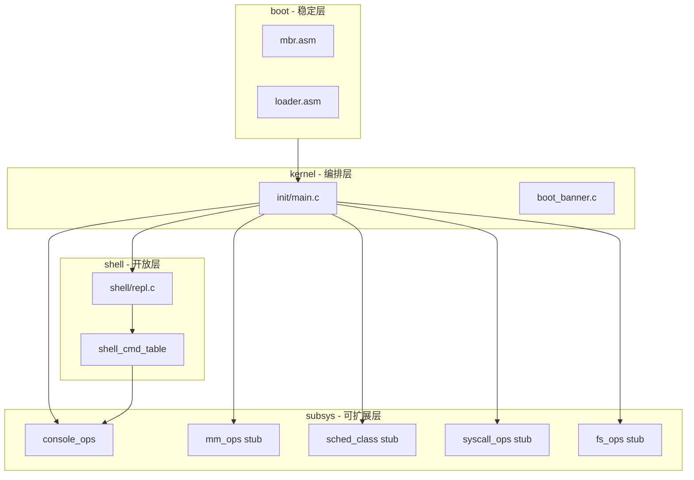
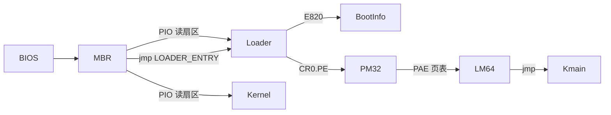

# AiTOS x86-64 基础架构迁移 — 设计方案

> 修订日期：2026-06-26  
> 分支：`feat-shell`  
> 状态：设计已定稿；实现进行中（见 [实现方案](../implementation/x86_64-migration.md)）

## 1. 修订目标

**本次交付标准**：不追求子系统功能完备，但必须具备**可运行的端到端链路**和**可扩展的基础骨架**。

| 维度 | 本次要做到 | 本次不做（留扩展点） |
|------|-----------|---------------------|
| 引导 | MBR → loader → Long Mode → `kmain`；**GRUB/Multiboot2** 见 [grub-boot.md](grub-boot.md) | UEFI、SMP |
| 内核 | 64 位高半区、中断框架、键盘输入、控制台输出 | 完整四级页表动态管理、用户态进程 |
| Shell | 启动后停留在 `[aitos@localhost]$`，5 个内置命令可用 | `ls/cd/mkdir` 等依赖完整 FS 的命令 |
| 扩展性 | mm/sched/syscall/fs 均有 **ops 接口 + 桩实现** | fork/exec、ELF 用户程序、IDE 实装 |
| 代码风格 | 对齐 AiTOS 内核编码规范 | — |

### 1.1 验收标准

```bash
make && make run-qemu
# 期望：Logo → 内核 init 日志 → Shell 提示符
# 可用命令：help、clear、version、echo <text>、uname

make debug && (gdb) c
# 期望：可断在 kmain，continue 后进入 Shell
```

## 2. 架构原则

### 2.1 分层与扩展点



**开闭原则落地**：

- **对扩展开放**：新子系统通过注册 ops / 命令表项接入，不修改 `init` 主流程
  - `mm_ops`：后续实现 `alloc_pages`/`map_page` 时只填充 ops
  - `sched_class`：后续实现抢占调度时注册 `fair_sched_class`
  - `shell_cmd`：新命令只向 `shell_cmd_table[]` 追加条目
- **对修改关闭**：`kmain` → `aitos_init()` → 各 `__init` 钩子；核心 REPL 循环不感知具体命令实现

### 2.2 AiTOS 编码风格（实施约束）

| 规范 | 要求 |
|------|------|
| 缩进 | Tab，宽度 8 |
| 行宽 | 80 列（注释、字符串可例外） |
| 命名 | `snake_case`；`struct aitos_xxx`；宏 `AITOS_XXX` |
| 类型 | `include/aitos/types.h`：`u8/u16/u32/u64`、`uintptr_t` |
| 初始化 | `__init` / `__initcall(fn)` |
| 日志 | `pr_info/pr_err` → `printk` → `console_ops` |
| 头文件 | `#include <aitos/xxx.h>`（基础类型、编译器属性、printk、errno 等） |
| 错误处理 | 返回负 errno（`-EINVAL`） |

**头文件布局**：

```text
include/aitos/     types.h, compiler.h, init.h, printk.h, errno.h,
                   boot_info.h, console.h, shell.h, mm.h, sched.h, ...
```

## 3. 目标内存布局

```text
物理地址
─────────
0x00000900   loader（GDT、boot_info 缓冲、实模式/保护模式代码）
0x00000b00   boot_info（magic、mem_bytes、kernel_phys）
0x00070000   kernel 物理加载区（ELF 或 flat binary）
0x00090000   页表区（PML4 / PDPT / PD，loader 建立）

虚拟地址
─────────
0xffffffff80000000   内核链接基址（KERNEL_VMA）
0xffffffff80009f000  主线程栈顶（STACK_TOP）
```

**页表策略**：

- PML4[511] → 内核高半区映射（`0xffffffff80000000`）
- PML4[0] → 低地址 identity map（至少 0–2MB，便于引导阶段访问物理内存）
- 引导阶段使用 2MB 大页简化实现

## 4. 引导链设计



### 4.1 MBR（`arch/x86_64/boot/mbr.asm`）

1. 初始化段寄存器、栈
2. VGA 简 Logo（`boot_logo.inc`）
3. PIO 读取 loader（扇区 2 起，4 扇区）→ `0x900`
4. 等待 IDE BSY 清除
5. PIO 读取 kernel（扇区 6 起，`KERNEL_SECTOR_COUNT` 扇区）→ `0x70000`
6. `jmp LOADER_ENTRY`

**约束**：MBR 必须**恰好 512 字节**，引导签名 `0x55AA` 位于偏移 510；Logo 与填充必须在签名之前。

### 4.2 Loader（`arch/x86_64/boot/loader.asm`）

1. **实模式**：`loader_start` — E820 内存探测，写入 `boot_info`
2. **实模式**：开启 A20（端口 `0x92`），`lgdt`，`CR0.PE=1`
3. **保护模式**：`jmp dword` 进入 32 位代码
4. **32 位**：建立 PAE 四级页表 @ `0x90000`
5. **32 位**：`CR4.PAE`、`IA32_EFER.LME`、`CR0.PG`，`jmp dword` 进入 Long Mode
6. **64 位**：设置段寄存器、RSP，跳转内核入口 `0xffffffff80000b54`

### 4.3 磁盘布局（`hd60M.img`）

| 扇区 | 内容 |
|------|------|
| 0 | MBR（512 B） |
| 2–5 | loader.bin |
| 6+ | kernel.bin / kernel.elf |

## 5. 分阶段实施（五阶段 MVP）

### 阶段 1：构建系统与基础头文件

- `arch/x86` → `arch/x86_64/`
- `Makefile`：`-m64`、`qemu-system-x86_64`、`-mno-red-zone`
- `arch/x86_64/linker.ld`：高半区链接
- `include/aitos/*` 基础头文件（types、compiler、init、printk、errno 等）

### 阶段 2：引导链

- MBR 单 section `[org 0x7c00]`，Logo 在填充之前
- loader：E820、`boot_info`、GDT、PM、PAE、Long Mode
- `include/aitos/boot_info.h`

### 阶段 3：架构层（运行 Shell 所需最小集）

| 模块 | 范围 |
|------|------|
| `arch/x86_64/print.asm` + `printk.c` | VGA `0xb8000` + debugcon `0xe9` |
| `arch/x86_64/kernel.asm` | 键盘中断 + `iretq` |
| `kernel/irq.c` | 64 位 IDT |
| `drivers/keyboard.c` | 扫描码环形缓冲 |
| `drivers/console.c` | `console_ops` |

**本阶段不做**：完整线程切换、syscall 实装、TSS/用户态。

### 阶段 4：子系统骨架

| 子系统 | 文件 | 行为 |
|--------|------|------|
| mm | `mm/bootstrap.c` | 读取 `boot_info`，桩分配器 |
| sched | `sched/core.c` | 单线程，`schedule()` 空实现 |
| syscall | `proc/syscall-stub.c` | 空表注册 |
| fs | `fs/fs-stub.c` | `init` 返回 0 |

旧 `memory.c`、`thread.c`、`fs/*.c` 等**保留源码、不参与 MVP 链接**。

### 阶段 5：Shell REPL + 调试

**内置命令**（`shell/cmd.c`）：

| 命令 | 说明 |
|------|------|
| `help` | 列出可用命令 |
| `clear` | 清屏 |
| `version` | 显示版本 |
| `echo` | 回显参数 |
| `uname` | 系统信息 |

- `shell/repl.c`：内核 REPL，读键盘缓冲、解析、分发
- `kernel/boot_banner.c`：内核启动 banner
- 更新 `scripts/debug-qemu.sh`、GDB 脚本、`.vscode/launch.json`

## 6. MVP 链接集

```text
kernel/main.c boot_banner.c irq.c printk.c
arch/x86_64/{kernel,print}.asm
drivers/{console,keyboard}.c
mm/bootstrap.c
sched/core.c
proc/syscall-stub.c
fs/fs-stub.c
shell/{repl,cmd}.c
lib/string.c
```

## 7. 不在本次范围

- fork / exec / ELF 用户程序
- 完整内存分配器、页表动态映射、用户地址空间
- 抢占式多线程调度
- IDE 磁盘、完整文件系统、`ls/cd/mkdir` 等命令
- ia32 双架构、UEFI、SMP/APIC

## 8. 后续扩展路径

| 后续功能 | 接入方式 | 无需改动 |
|---------|---------|---------|
| 物理页分配 | 实现 `mm_ops` 并 `mm_set_ops()` | `aitos_init()` |
| 线程调度 | 注册 `sched_class`，启用 `thread.c` | `schedule()` 入口 |
| 系统调用 | 填充 `syscall_table[]` | Shell 可选走 syscall |
| 文件系统 | 实现 `fs_ops`，链接 `fs/*.c` | REPL 解析循环 |
| 新 Shell 命令 | `shell_cmds[]` 追加一行 | `cmd_dispatch()` |

## 9. 风险与对策

| 风险 | 对策 |
|------|------|
| 旧代码与骨架双轨 | Makefile `CONFIG_*` 控制链接集；旧文件保留不删 |
| 裁剪后符号缺失 | 桩文件提供空实现 |
| MBR 布局错误导致无法引导 | 单 section + `times 510-($-$$)` 保证 512B |
| PIO 多扇区读取不完整 | 每扇区等待 DRQ；或紧凑 loader 布局 |
| 16 位模式下 `mov eax,cr0` 不可靠 | 使用 `mov eax, 0x11` 显式置 PE 位 |
| 保护模式远跳转 | 使用 `jmp dword SELECTOR:offset` |
